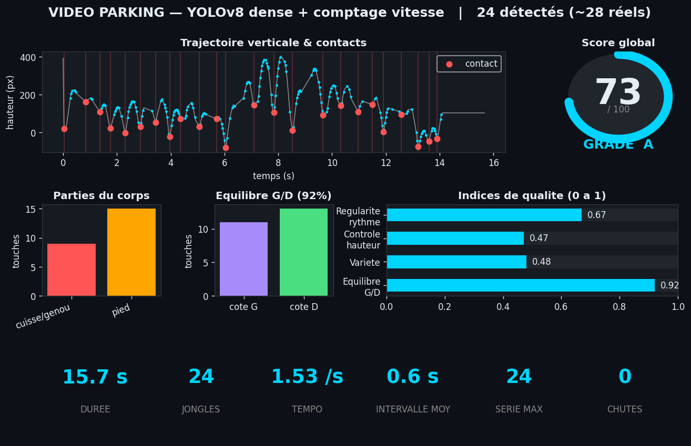

# Jonglerie — Analyse vidéo de jongle foot

Pipeline de vision par ordinateur qui transforme une **vidéo de jonglage** en
**métriques de performance + score**, pour aider un joueur à progresser.

À partir d'une simple vidéo (téléphone), le système suit le ballon, compte les
jongles, classe les touches (pied / cuisse / poitrine / tête, côté gauche/droite),
mesure le rythme, le contrôle, l'équilibre G/D, et calcule un score global noté
de S à D — avec une **vidéo annotée** et un **tableau de bord** en sortie.

---

## Résultats sur 3 vidéos de test

| Vidéo | Conditions | Sans YOLO | Avec YOLOv8 | Vérité |
|---|---|---|---|---|
| **1 — terrain** | plan large, vêtements sombres, ballon clair | **12** ✅ | — | 12 |
| **2 — gros plan** | contre-plongée, ballon flou, fond chargé | ~13 ❌ | — | ↑ |
| **3 — parking** | maillot jaune **+** ballon jaune | 23 ❌ | **24** (→ ~28) | 28 |

Le parcours sur ces trois vidéos (de la plus facile à la plus dure) est l'histoire
du projet : il montre **pourquoi** une détection couleur ne suffit pas et **comment**
YOLOv8 + un comptage robuste rétablissent la fiabilité. Détails dans
[`docs/METHODOLOGY.md`](docs/METHODOLOGY.md).



---

## Architecture

```
vidéo ─► [1] Détection ballon ─► [2] Contacts ─► [3] Zone corps ─► [4] Métriques ─► [5] Score ─► [6] Rendu
            couleur OU YOLOv8       (= jongles)    (partie/côté)     (G/D, rythme…)  (pondéré)    (vidéo+dashboard)
```

Deux briques de détection interchangeables, **tout le reste est commun** :

- **Sans YOLO** (`src/analyzer.py`) : détection couleur + mouvement, association
  globale par Viterbi. Auto-suffisant (aucun modèle à télécharger), mais
  spécifique aux conditions de tournage.
- **Avec YOLOv8** (`src/analyzer_yolo.py`) : détecteur COCO « sports ball » exécuté
  via OpenCV DNN (`src/yolo_onnx.py`) — **aucune dépendance torch/ultralytics**.
  Robuste d'une vidéo à l'autre sans réglage. Plus :
  - comptage par **inversion de vitesse verticale** (plus sensible),
  - **rattrapage** des jongles cachés dans les trous de flou via un 2ᵉ signal,
    le **mouvement de jambe** (`src/kick_motion.py`).

---

## Installation & utilisation

```bash
pip install -r requirements.txt

# --- Mode classique (sans modèle) ---
python src/analyzer.py ma_video.mp4 out/
python src/make_dashboard.py out/metrics.json out/_y.npy out/_m.npy out/_contacts.json 30 "Ma session" out/dashboard.png

# --- Mode YOLOv8 (recommandé) ---
# 1. exporter le modèle une fois :
pip install ultralytics && yolo export model=yolov8m.pt format=onnx imgsz=640
# 2. analyser :
python src/analyzer_yolo.py ma_video.mp4 out_yolo/ yolov8m.onnx
```

Sorties : `out/annotated.mp4` (suivi + compteur live), `out/metrics.json`, dashboard PNG.

---

## Métriques produites

Durée, **nombre de jongles**, tempo (touches/s), **répartition par partie du corps**,
**équilibre gauche/droite**, régularité du rythme (CV des intervalles), contrôle
(stabilité de hauteur), variété, plus longue série, chutes — puis un **score /100**
pondéré par la difficulté des touches (tête > poitrine > pied > cuisse) avec un
grade **S/A/B/C/D**. Voir `metrics.json` dans chaque dossier de `results/`.

---

## Contenu du dépôt

```
src/                 code du pipeline (classique + YOLO + signal jambe + dashboard)
results/
  video1_terrain/    cas favorable — compte exact (12)
  video2_closeup/    cas d'échec couleur — démontre la limite
  video3_parking/    comparaison complète sans/avec YOLO + version améliorée
dataset/             47 images auto-annotées (format YOLO) pour fine-tuner
docs/METHODOLOGY.md  le détail technique et le parcours sur les 3 vidéos
```

Le modèle `yolov8m.onnx` (~103 Mo) **n'est pas versionné** (voir `.gitignore`) :
il s'obtient en une commande (ci-dessus).

---

## Limites connues & feuille de route

| Limite actuelle | Correctif |
|---|---|
| YOLO-COCO rate le ballon en **flou de mouvement** (trous de détection) | **Fine-tuner** sur `dataset/` (+ frames floues) → trous supprimés |
| Couverture partielle entre détections | Ajouter un tracker **ByteTrack** |
| Pied G/D et figures = **proxy** (hauteur/position) | **MediaPipe Pose** (cheville/genou réels) + LSTM pour les figures |
| Mesures en **pixels** (relatives) | Calibration via Ø ballon connu (22 cm) → cm / km·h |
| YOLOv8m CPU ≈ 1,3 s/frame | GPU / yolov8n / TensorRT pour le temps réel |

**Prochaine étape la plus rentable :** brancher MediaPipe Pose — elle donne à la
fois le compteur de coups de pied propre (rattrape les jongles des trous) et le
**vrai pied gauche/droit**, sans dépendre d'un entraînement.

---

*POC développé itérativement sur 3 vidéos réelles. Détection ballon, comptage,
métriques, score et rendu sont fonctionnels ; la détection est le composant à
faire évoluer (fine-tuning) pour un usage en production.*
