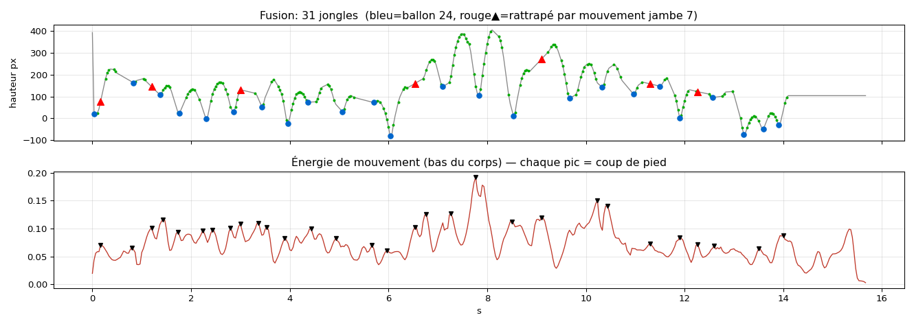

# Méthodologie & parcours technique

Ce document détaille comment le pipeline fonctionne et **pourquoi** il a évolué,
à travers trois vidéos de test de difficulté croissante.

---

## 1. Le pipeline, brique par brique

### [1] Détection du ballon

**Mode classique** (`analyzer.py`) — sans aucun modèle à télécharger :
- candidats **couleur** : blob clair, non-vert, rond ;
- candidats **mouvement** : différence inter-frames (rattrape le ballon devant le corps) ;
- **association globale par Viterbi** : choisit, sur toute la séquence, la suite de
  candidats qui minimise les sauts et récompense la circularité → trajectoire propre.

**Mode YOLOv8** (`yolo_onnx.py`) — détecteur COCO « sports ball » (classe 32),
exécuté via `cv2.dnn.readNetFromONNX` : **pas de torch ni d'ultralytics requis**.
Il reconnaît le ballon par sa forme/texture apprise, indépendamment de sa couleur,
du fond ou des vêtements.

### [2] Comptage des contacts (= jongles)

Un contact = le ballon **au plus bas** avant de repartir, c.-à-d. un minimum local
de hauteur. Deux méthodes :
- **pics** (`scipy.signal.find_peaks` sur la hauteur) — robuste, simple ;
- **inversion de vitesse verticale** — la vitesse passe de « descend » à « monte ».
  Plus sensible aux jongles rapides et bas (utilisée dans `analyzer_yolo.py`).

### [3] Zone du corps (proxy)

Classe chaque contact (pied / cuisse-genou / poitrine / tête) selon la **hauteur**
du ballon, calibrée sur le clip ; côté G/D selon la position horizontale. C'est un
**proxy** — à remplacer par MediaPipe Pose pour le vrai pied gauche/droit.

### [4] Métriques

Durée, nombre de jongles, tempo, répartition par zone, équilibre G/D, **régularité**
(coefficient de variation des intervalles entre touches — faible = métronomique),
**contrôle** (variance relative de la hauteur des apex — faible = maîtrise), variété
(entropie des zones), plus longue série, chutes.

### [5] Score

`points par touche × difficulté` (tête 1,6 > poitrine 1,2 > pied 1,0 > cuisse 0,8)
`+ bonus` (équilibre, régularité, contrôle, variété, durée) `− pénalités` (chutes),
normalisé sur 100, grade **S/A/B/C/D**.

### [6] Rendu

Vidéo annotée (cercle de suivi, traînée, compteur live, flash au contact) +
tableau de bord PNG + `metrics.json`.

---

## 2. Le parcours sur 3 vidéos

### Vidéo 1 — terrain (cas favorable) → **12 / 12 ✅**

Plan large, joueur en vêtements **sombres**, ballon clair, fond gazon/ciel simple.
Le détecteur couleur isole parfaitement le ballon (seul objet clair). Après réglage
du seuil de prominence (un faux positif venait de pics faibles en zone interpolée),
le compte tombe **exact à 12**.

> Leçon : en conditions idéales, la vision classique suffit.

### Vidéo 2 — gros plan (cas d'échec) → détection couleur en échec ❌

Contre-plongée serrée, sweat **gris clair** + main visible, ballon souvent **flou**,
fond chargé (clôture, troncs). Le détecteur couleur s'accroche à la main et au sweat
(clairs, ronds) au lieu du ballon ; de longs **plateaux plats** dans la trajectoire
trahissent des zones où le ballon n'est jamais détecté.

> Leçon : une heuristique couleur est **calée par condition de tournage**. Elle ne
> généralise pas. Il faut un détecteur appris → YOLO.

### Vidéo 3 — parking (cas le plus dur) → comparaison sans/avec YOLO

Maillot **jaune** + ballon **jaune-bleu**, pas de gazon vert : pire cas couleur.

| | Sans YOLO | Avec YOLOv8 (dense + fusion) | Vérité |
|---|---|---|---|
| Jongles | **23** (faux verrous maillot/short/béton) | **24** (→ ~28) | 28 |
| Détection | accroche tout ce qui est clair | **toujours le ballon** | |

**Obtention du modèle dans un environnement réseau restreint** : les *releases*
GitHub et les CDN de modèles étaient bloqués ; un `yolov8m.onnx` versionné en clair
dans un dépôt a été récupéré via `codeload`, puis exécuté par OpenCV DNN.

---

## 3. Fiabiliser le comptage (vidéo 3 : 16 → 24)

Trois leviers appliqués :

1. **YOLO sur toutes les frames** (au lieu d'1 sur 2) + seuil bas (0,10).
   Couverture de détection 18 % → 42 %. Sûr car YOLO ne confond pas le maillot.
2. **Comptage par inversion de vitesse** : récupère les jongles rapides et bas.
3. **Rattrapage gaté** dans les trous (YOLO à 0,05 près de la position prédite).

Résultat : **24 jongles**, tous posés sur de vrais creux d'arc.

### Le résidu (24 vs 28) et le 2ᵉ signal

Diagnostic : il reste **8 trous de détection ≥10 frames** (jusqu'à 21 frames).
Le ballon y est en **flou de mouvement** → YOLO-COCO ne le voit pas, même à 0,05.
Sans échantillon dans le trou, l'interpolation passe en ligne droite et **efface le
creux** : un contact non échantillonné est invisible à la trajectoire.

D'où un **second signal indépendant** (`kick_motion.py`) : l'**énergie de mouvement
du bas du cadre** — chaque coup de pied fait un pic. Seul, il estime **~30** jongles.
La vérité (28) se situe entre le ballon (24) et la jambe (30), ce qui **encadre**
correctement le vrai compte. La fusion les combine en n'ajoutant les coups de pied
que **dans les trous** de détection du ballon.

> Pour atteindre 28 de façon exacte et robuste, deux leviers (non bricolés) :
> - **fine-tuner YOLO** sur `dataset/` enrichi de frames floues → supprime les
>   trous → la méthode ballon seule atteint ~28 ;
> - **MediaPipe Pose (cheville)** → signal de coup de pied propre et bien daté,
>   + le **vrai pied gauche/droite**.

---

## 4. Limites & unités

Les mesures de hauteur/vitesse sont en **pixels** (relatives, mono-caméra). Pour des
unités métriques (cm, km/h), calibrer avec le diamètre connu du ballon (~22 cm) dans
l'image. Les figures (around-the-world, etc.) nécessitent un modèle temporel (LSTM)
sur la pose — non couvert par ce POC.
